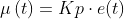
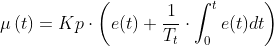
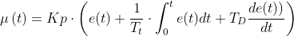
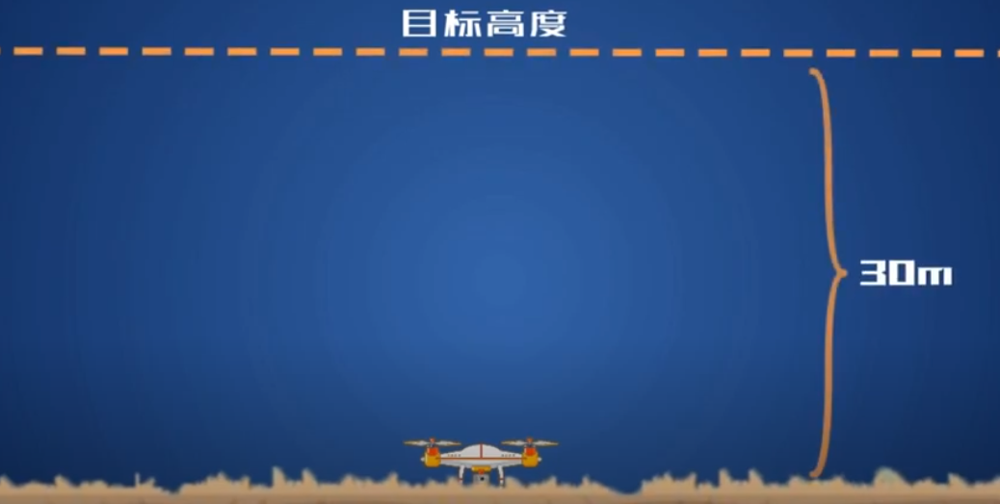
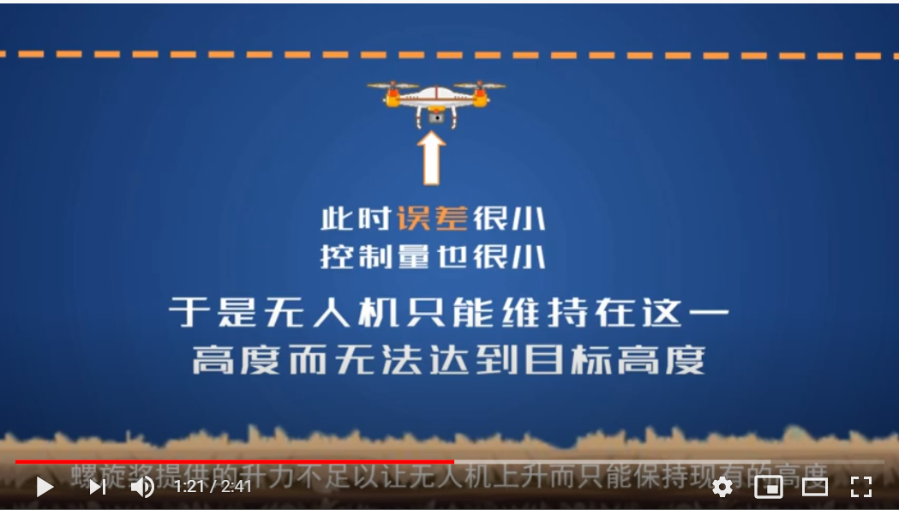
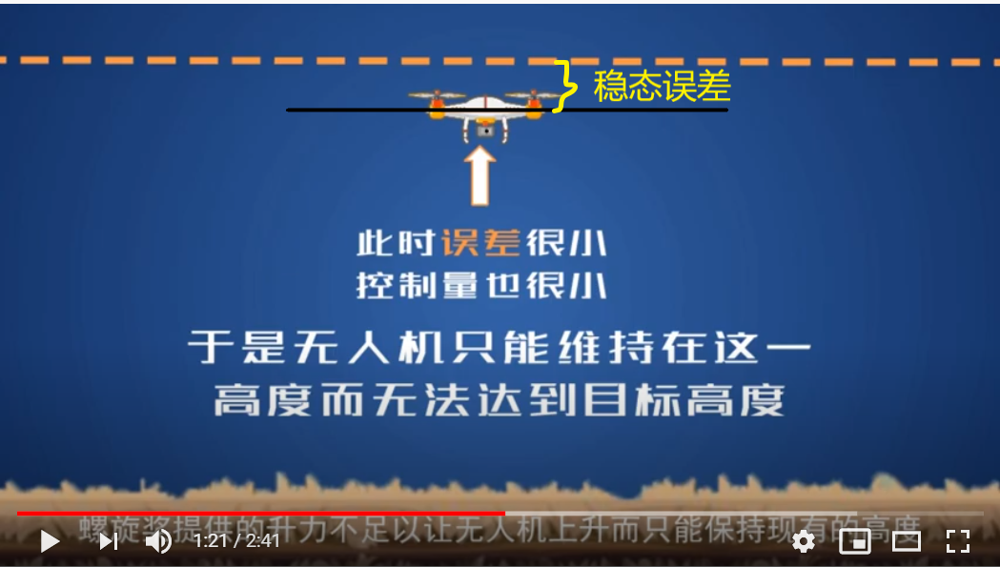

# PID表示

## 位置式PID表示

表示方法1：

P控制：

PI控制：

PID控制：

## 增量式PID表示

## 关于P - Proportion

比例控制可以快速地减少误差，但是当误差小于一定值时，也就是控制量小于一定值，螺旋桨提供的升力不足以让无人机上升而只能保持现有的高度。

## 关于I - Integral

积分控制提供了一定的**惯性**

### 说下积分时间常数

## 关于D - Derivation

微分控制提供了一定的**阻尼**

## 场景

### 场景1 - 控制无人机飞行到距离地面30m位置

所用传感器：气压高度传感器，获取当前的高度

控制量：无人机螺旋桨转速的大小

仅使用比例控制，可以快速地减小误差，但当误差量小于一定值时，也就是控制量小于一定值时，螺旋桨提供的升力不足以让无人机上升而只能保持现有的高度。

仅使用比例控制，会造成稳态误差，如下，

稳态误差不会随着时间推移而被比例控制消除。

实际控制过程中，会有外部环境的变化，试想突然从上方刮来一阵风，无人机的高度急剧下降，微分控制器计算误差的变化率。当无人机快速地下降时，微分控制量将随着误差的变化率的增大而增大。
