# 汽车组成部件

节气门，火花塞，喷油嘴的实物图片如下，

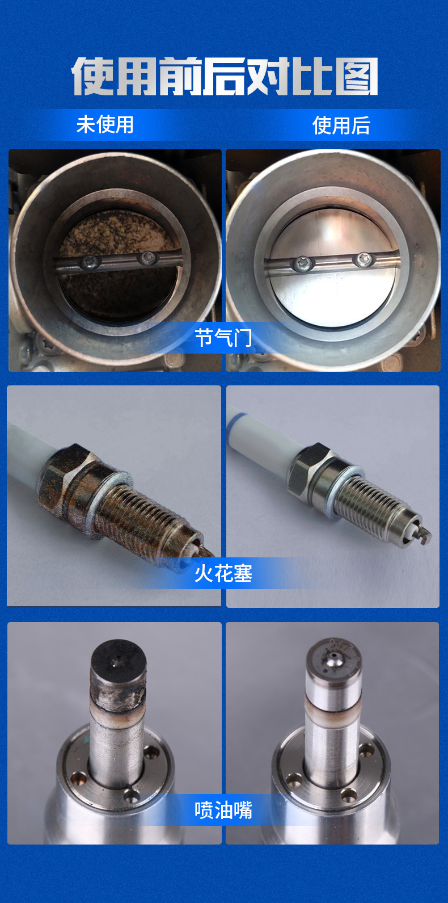

## 节气门总成

现代汽车的节气门总成如下：

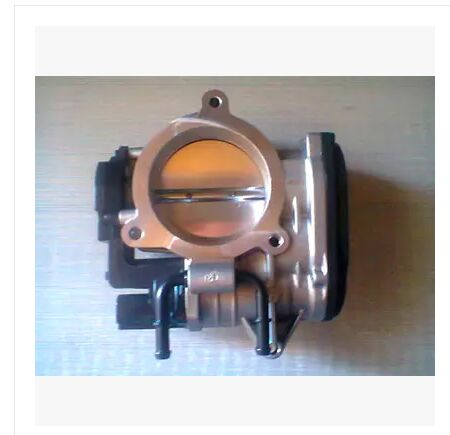

别克汽车的节气门总成如下：

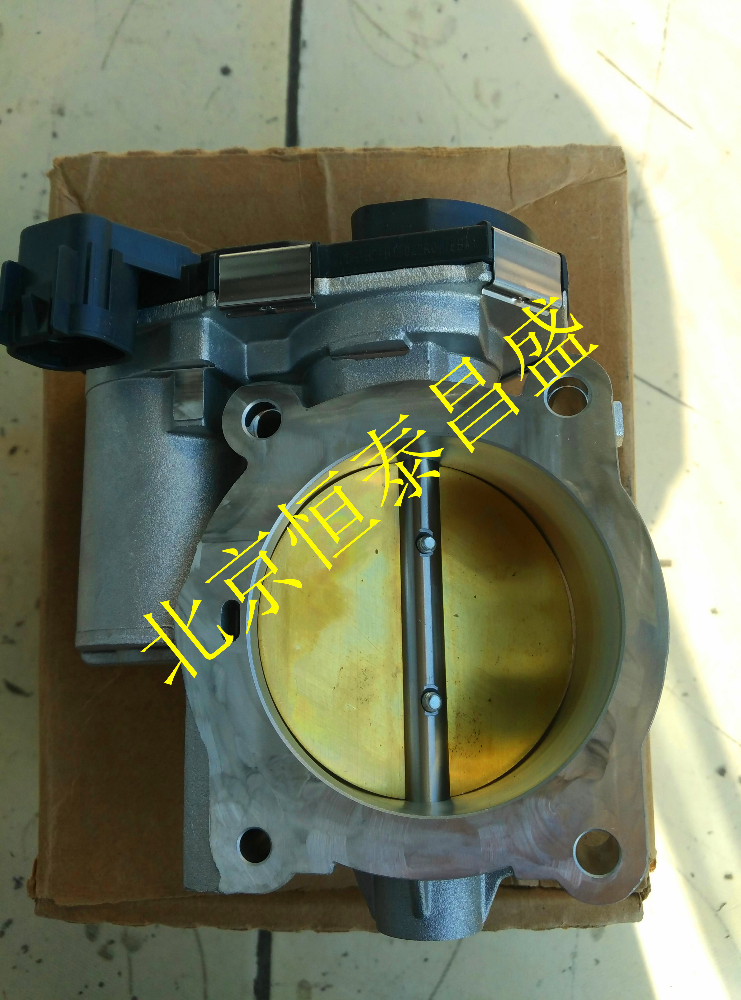

三菱/猎豹汽车的节气门总成如下：

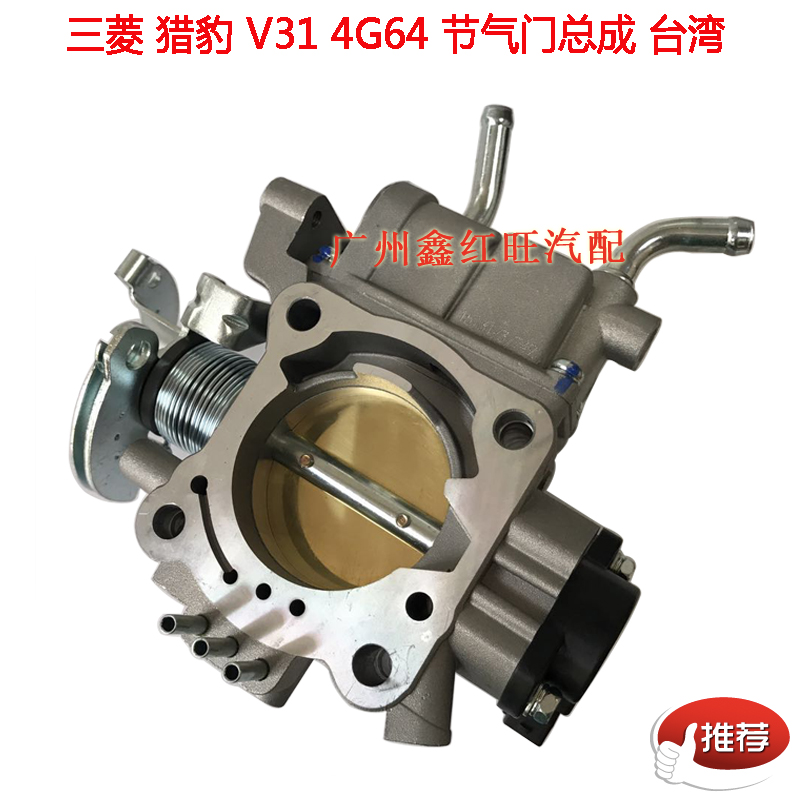

# XianKong

一共有3个电机，驱动电机（绿通），转向电机（松灵后加），驻车电机（松灵后加）。

汽车线控系统需要的相关传感器有：

- 角位移传感器
- 转矩传感器
- 车速传感器
- 侧向加速度传感器
- 横摆角速度传感器

# 线控历史

最早源于飞行控制系统。它将飞行员执行的操作动作转变成弱电信号，再通过弱电信号控制强电执行机构的方式来实现相应的飞行控制。

# 车体坐标系

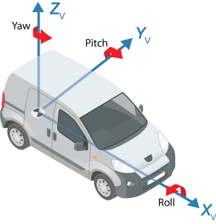

一辆车要能够跑起来，最基本的是横向控制和纵向控制。横向控制指的是车能够在y方向上移动，纵向控制指的是车能够在x方向上移动。

# 线控的功能框图

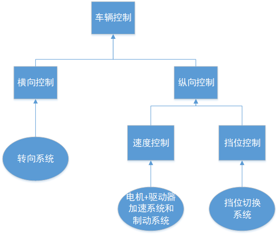

每一个系统并不是独立在工作，而是相互之间有依存关系，例如，单独把转向系统剥离出整车，它是不会工作的，必须接入到整车环境中。

## 线控加速

纵向控制分为3个核心控制：加速控制，减速控制和档位调换。

节气门那里需要接一个伺服电机(servemotor)

The "Position sensor" senses how much you press the "Gas Pedal".

线控油门的实现示意图，

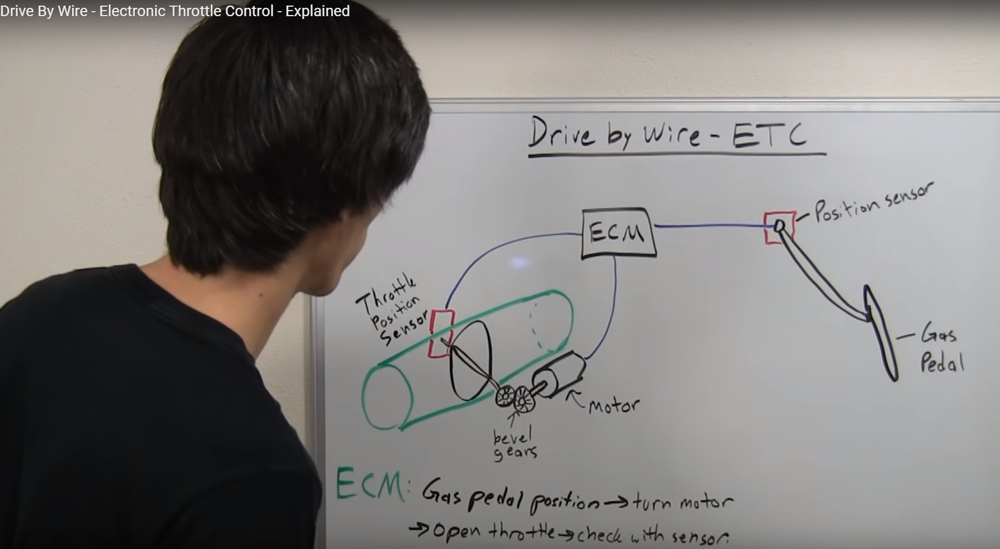

"Position sensor"的实物图如下：

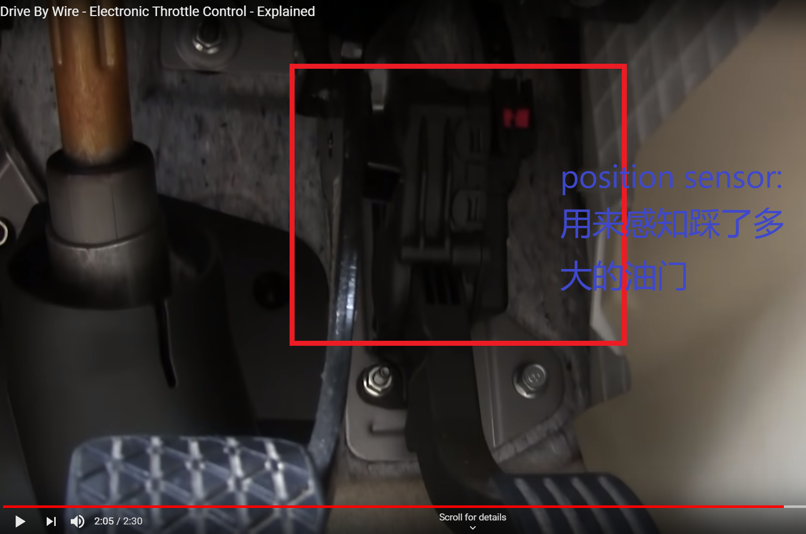

ECU，电机的实物图如下：

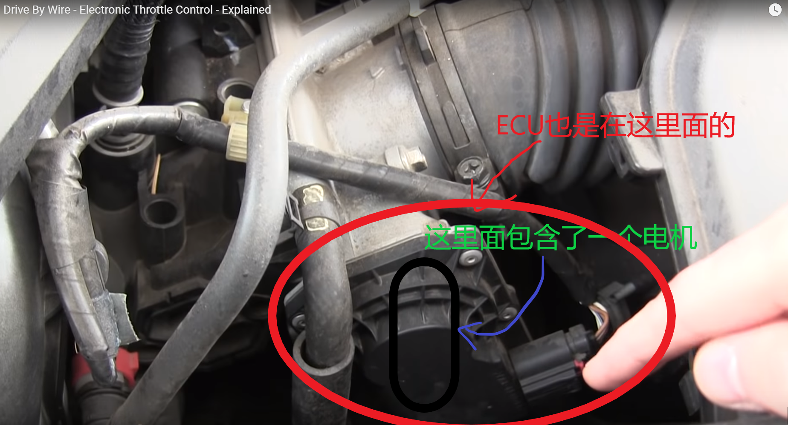


## 线控转向

Steer-by Wire，简称"SbW"，线控转向

让车辆仅通过电子信号实现安全可靠的转向。

耐世特实现了“随需转向系统”和“静默方向盘系统”。

1. 转向助力系统(EPS)
当驾驶员在进行转向动作时，车辆会捕捉驾驶员的转向动作并持续输出一个辅助转向力让转向变得更加轻便。转向力输出主要依靠助力系统来完成，助力系统包括：

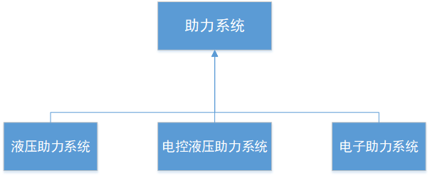

传统的“机械转向系统”的示意图如下：

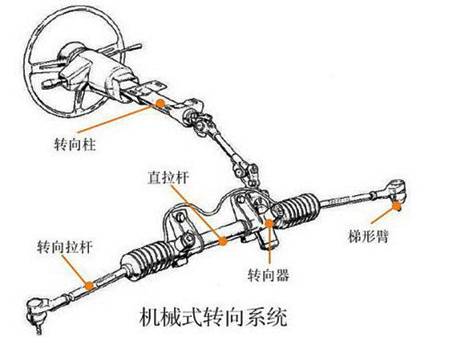

“液压助力转向”的示意图如下：

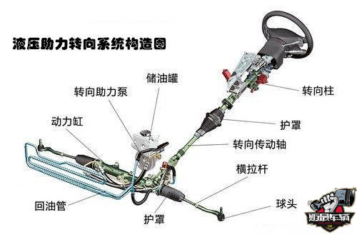

“电子助力转向”的示意图如下：

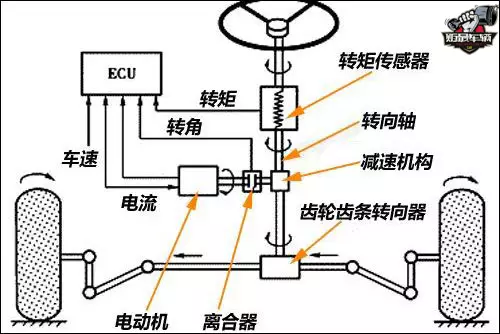

横向控制系统主要包括机械转向部分和电子助力部分。

- 机械转向部分

通过机械传动将方向盘转动量变成车轮的转角量。机械传动部分包括转向杆，万向轴，转向机和拉杆。

- 电子助力部分

将人类纯机械的动能输入转换成通过电机转动来实现转向机的动能输入，主要包括转向电机，转向传感器和转向控制器。

在乘用车中，液压助力和电控液压助力逐渐被电子助力系统取代，因此这里讨论的线控改装是基于电子助力转向来实现的。


## 线控制动


舍弗勒自己做了个模块，叫做“舍弗勒智能转向驱动模块”。这个模块是一个高度集成的车轮悬架单元，将包括轮内电机在内的所有驱动和底盘零部件都集成在一个紧凑的模块内。


## 线控供应商

公司英文名 | 公司中文名 | 所在国家 | 在华研发中心数量 | 在华主要城市 | 在华主要合作伙伴 | 其他
-----|-----|------|------|------|------|------
Nexteer  |  耐世特  |  德国  |  2  |  1. 上海市嘉定区安亭镇 2. 湖南湘江新区  |  湖南政府  |  无
Schaeffler  |  舍弗勒  |  德国  |  2  |  1. 上海市嘉定区安亭镇 2. 湖南湘江新区  |  湖南政府  |  无
其他  |  verb  |  放水时间  |  其他  |  其他  |  其他
其他  |  verb  |  水桶大小  |  其他  |  其他  |  其他


### 好的参考资料

#### 好的Youtube视频介绍

这下面几个视频都是在Youtube上找到的比较好的介绍线控的视频。

https://www.youtube.com/watch?v=QGdEM2TRajw


https://www.youtube.com/watch?v=IYm2C7zr82Q

https://www.youtube.com/watch?v=Pgln9L5Y7sQ

https://www.youtube.com/watch?v=7SnpLfCF-r4

#### 好的文章列表


## STM32F103系列 与 STM32F4xx 系统的区别

STM32F4xx是基于Cortex-M4的
```
    Cortex-M4的一个核心功能是具有单精度浮点运算单元，其支持所有ARM单精度（注意是ARM单精度，不是x86单精度）
    数据类型与数据运算。文档的原话是："The Cortex-M4 core features a Floating point unit(FPU) single
    precision which supports all ARM single-precision data-processing instructions and data types."
```

STM32F103系列是基于Cortex-M3的

参考文章

http://news.eeworld.com.cn/mcu/ic473892.html

http://news.eeworld.com.cn/mcu/ic476318.html

## 关于AB相编码器

“叉车项目，建图，路径规划，壁障等问题的讨论”这封邮件里面有详细的解释，该邮件创建于2017-09-22，11:37 AM

## EPS

SWD接口可以用于程序下载和调试。USART串口，用于外接USB转串口模块进行固件升级。
我的问题是：
1. SWD是否可以用来做固件升级
我自己给出的答案是：可以

2. USART串口是否可以用于程序下载和调试
我自己的答案是：不可以

《EPS使用说明书.pdf》没有说明转向直流电机4个PIN角的线序，也没有说明扭矩传感器5个PIN角的线序
